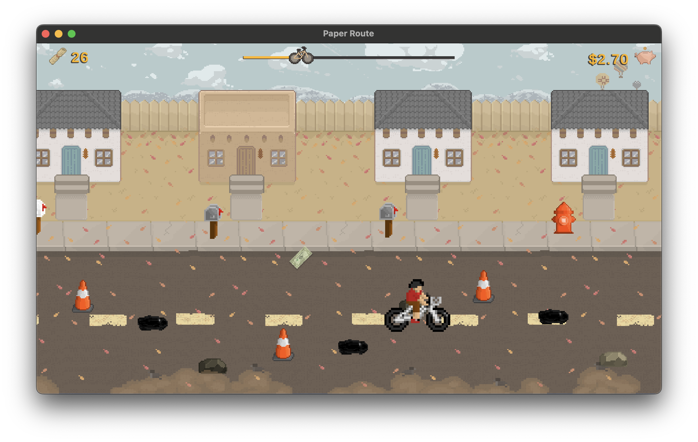

# Paper Route

By Andrew Valdez, Gale Scriven, & Chris DeBonis

## How to Play

Run `PaperRoute.exe` for Windows or `PaperRouteMac.exe` for Mac, both can be found within the **Builds** folder in the **Windows** and **Mac** folders respectively.

Selecting **Quit** button will terminate the application. Selecting **Start** will begin the first run of the game.

A series of billboards will give the player a brief introduction to the game's systems. 

`WASD` allows the player to move about the play area.  
`Space` or `Left-Click` allow the player to throw paper.

The amount of money earned with each paper will be determined by the zone it lands in. The *lawn* earns **5¢**, the *walkway* earns **10¢**,  and the *doorstep* earns **25¢**.

Obstacles in the road will incur a movement penalty when hit and should be avoided by the player.

`Esc` allows the player to pause at any time.

Holding down `Space` or `Left-Click` will prompt a power meter to appear. While held down, the power meter will alternate from low to high power. Releasing `Space` or `Left-Click` will launch a paper toward the top of the screen with its velocity determined by the power meter.

Each route consists of 30 houses and 30 papers to distribute. Following each route, the player will encounter a shop where they can choose to spend their money on bike upgrades or progression to the next level. The option of going on another route to earn more money is also available.

Purchasing the next level will change the season, introducing new obstacles and visuals. The cost of each new level will increase as the player progresses.

Once the final level has been purchased, the player will have earned enough to end the game.

## Contributions

**Andrew** served as the lead programmer, writing all of the game code. Additionally, Andrew also created much of the art in the game including all backgrounds, buildings, UI elements, and the dollar bill sprite.

**Gale** served as an artist on the game. Gale created the character sprite as well as all of the obstacle sprites.

**Chris** served as the producer, preparing game design documents and presentation. Chris also compiled free-use sounds to be used in the game.